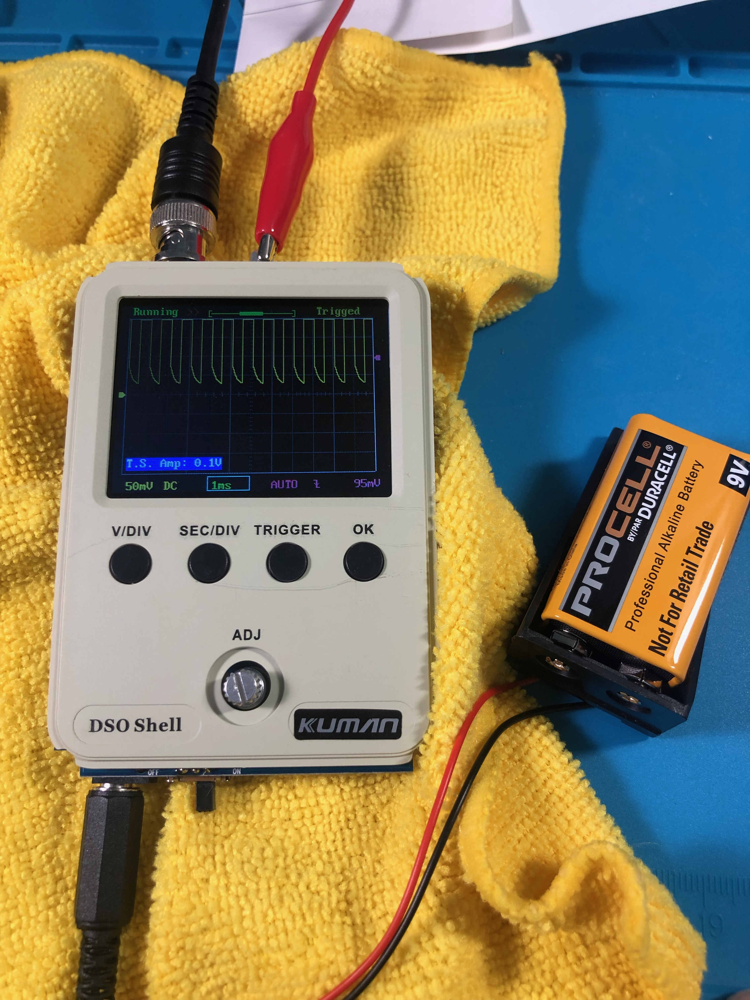
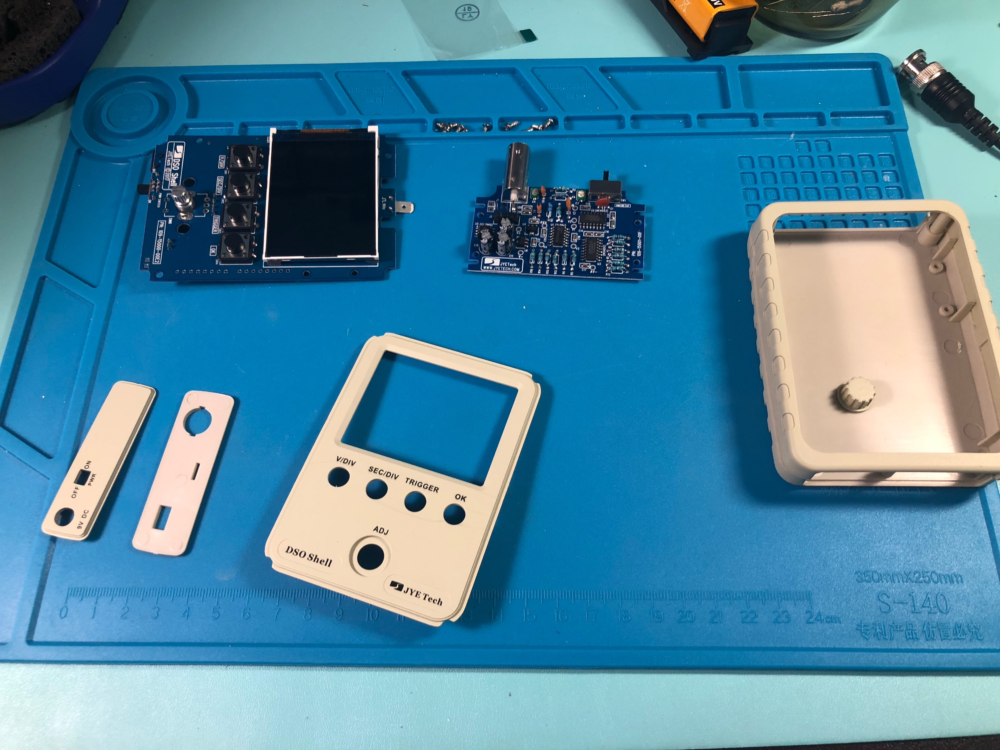
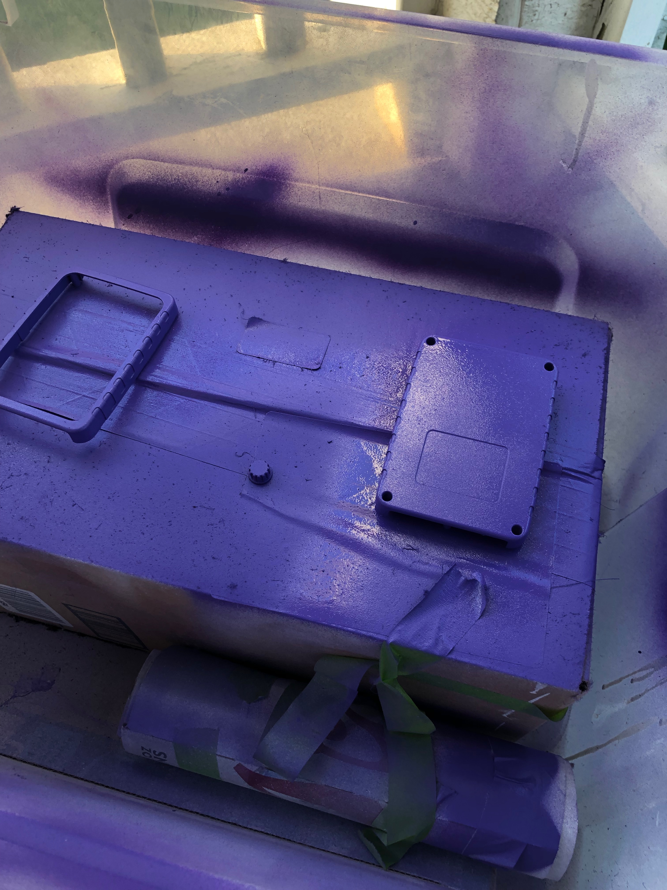
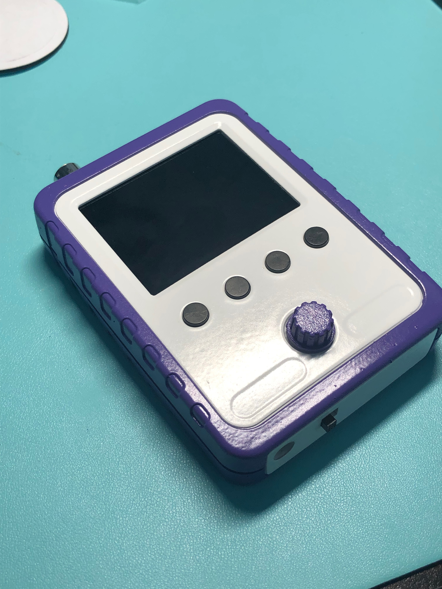

# Oscilloscope Build

Building an oscilloscope? Why?? Because it's cheap, a learning experience, and is something I'd like to use for some other problems
with things like looking at and learning analogue button debouncing.

And because we're always a bit extra on this stream, of course we
gave it a custom paint job. White, Twitch Purple, and a gloss clearcoat.

If you like this and would like to get a kit for yourself, do enjoy:

[Oscilloscope kit](https://www.amazon.com/gp/product/B01N6PUX70)

Here's the very first result of assembly. The case is not fixed (because we're going to paint it later). But our power-up, tests, and actual bootup succeeded. The display looks wonk because we haven't really calibrated it at this point.

