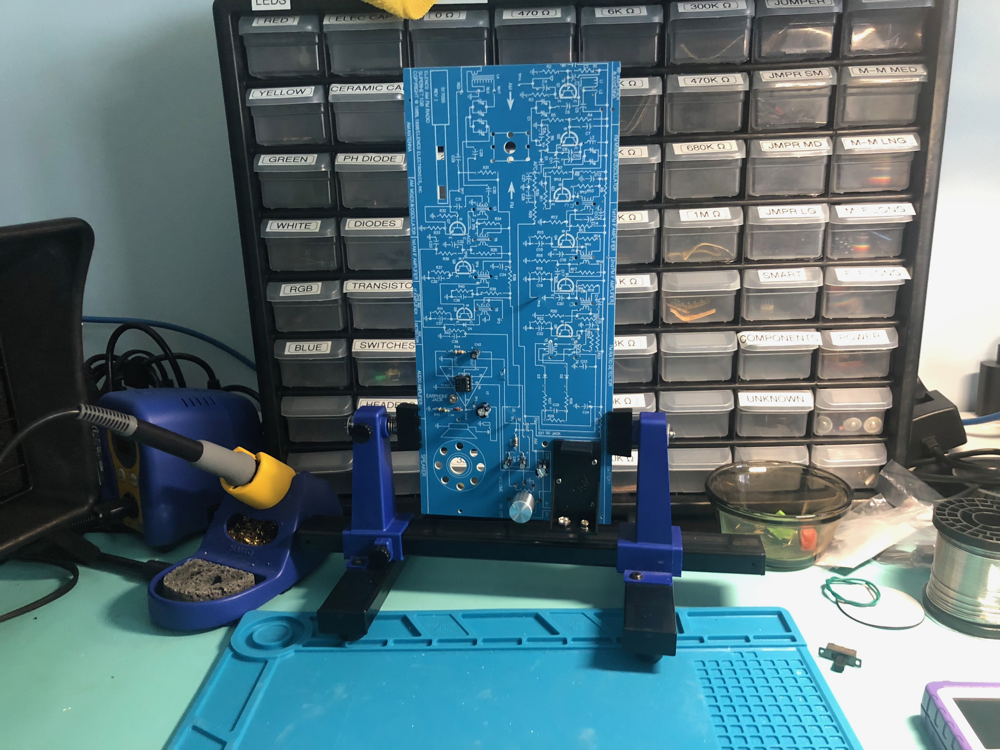
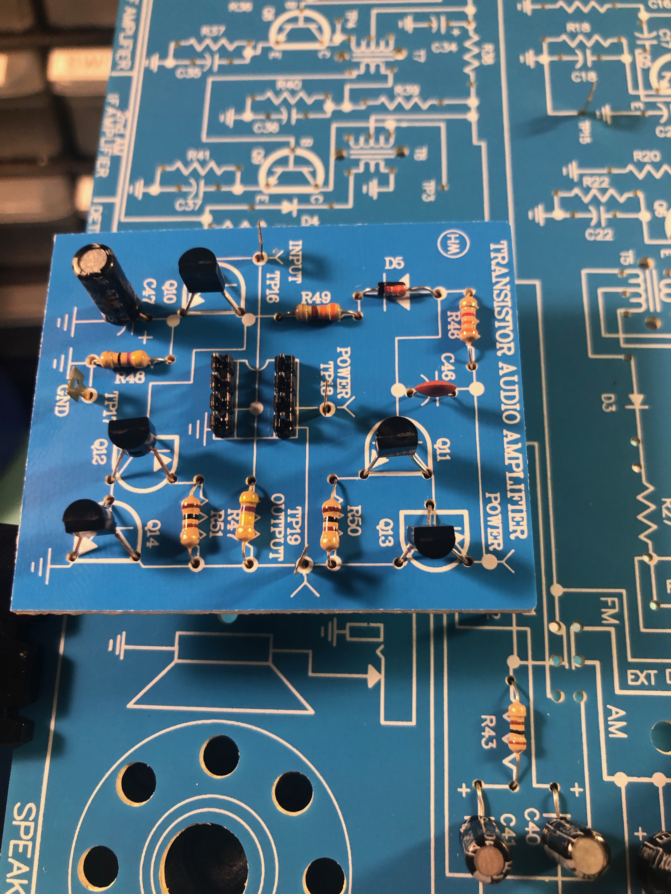

# AM / FM Radio Build

So why would we want to build this radio?

Well, it's a fantastic kit, and a good opportunity to learn a bit more depth
about electronics and how radios even work. If you're curious, you can get the
it and the PDF version of the instructions here:

- [Project Manual](https://www.elenco.com/wp-content/uploads/2017/10/AMFM-108CK_low-res-2.pdf)
- [Project Purchase Page](https://www.amazon.com/gp/product/B008515U1U)

The part I really like about the guide is that it teaches you along the way not
only how a radio works, but how your testing tools work. Things like using your
multimeter, types of transistors (PNP vs NPN), polarity of certain components, etc.
Great stuff!

## Here's a few shots from our current build

Here's the first couple of components assembled in "part 1A" from our Day 1 stream on the project:

What we've done here is complete "part 1B" where we essentially remove the IC chip, build a board
with all the components that were inside that IC chip, and plug this new board into the socket
that used to hold the IC chip (via the 2 sets of 4-pin headers you see right in the middle of that
board):

